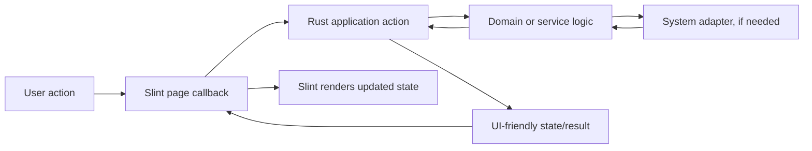

# Architecture

This document describes Cockpit's current structure and the intended direction for features as they are added. The current repository is a starter shell; proposed layers below are conventions for implementation, not claims that workspace, Git, or review services already exist.

## Current shape

```text
src/main.rs ── creates and runs ──> MainWindow
                                      │
                                      └── ui/main.slint

build.rs ── compiles Slint UI ──> generated Rust bindings
```

The Rust entry point initializes the generated Slint `MainWindow` and runs the app. `build.rs` compiles `ui/main.slint`. There is not yet a workspace model, Git integration, persistence layer, or application service layer.

## Intended responsibility boundaries

### Slint frontend (`ui/`)

- Own screen composition, reusable components, visual state, presentation logic, and user intent callbacks.
- Keep simple local conditions and display logic beside the UI.
- When a page becomes large, keep its page composition and layout in a page UI file and move cohesive frontend state or presentation behavior into same-folder Slint companion files. See [UI component guidance](ui-components.md).
- Keep page-specific components with the page; promote components to shared UI only when they are actually reused.
- Do not implement filesystem, Git process, persistence, or other external side effects in the UI.

### Rust application boundary (`src/`)

- Own app initialization, coordination between UI and services, and the conversion of service results into UI-friendly state.
- Keep Rust types crossing into Slint stable, explicit, and suitable for presentation.
- Connect callbacks to application actions and update Slint properties from results; avoid duplicating frontend state in Rust without a clear owner and synchronization rule.

### Domain and service logic (`src/` as it grows)

- Place application rules and behavior that is independent of rendering in focused Rust modules.
- Model expected failures explicitly and map them to concise UI states at the application boundary.
- Keep each module focused around a domain responsibility. Introduce further layers only when they clarify dependencies, testability, or ownership.

### System adapters (`src/` as needed)

- Isolate filesystem access, Git invocation, persistence, and other operating-system interactions behind small interfaces or modules.
- Pass process arguments without shell interpolation; treat workspace paths and repository data as untrusted.
- Do not run repository hooks, scripts, builds, or arbitrary commands as a side effect of opening or refreshing a workspace.
- Keep external effects out of pure domain rules where practical so those rules can be tested deterministically.

## Intended feature flow

For a future workspace action, the intended flow is:



Keep the flow direct for small features. Do not introduce an event bus, dependency injection framework, global state container, or generic repository abstraction unless a concrete need justifies it.

## Dependency direction

- UI components depend on their declared properties and callbacks, not on Rust service internals.
- Application coordination may depend on domain/service modules and adapters.
- Domain rules should not depend on Slint rendering types or concrete operating-system processes.
- System adapters implement the narrowest boundary required by application behavior.
- Shared utilities should represent a real shared concept; do not move code into a generic utility module only to avoid local ownership.

## Testing implications

- Test pure Rust rules at the unit level.
- Test service and adapter interactions at integration boundaries with controlled temporary fixtures or fakes.
- Test Slint state-to-view behavior and user interactions at the UI layer; use targeted visual checks when automated UI testing is not practical.
- Avoid testing private implementation shape when a stable behavior contract is available. See [testing strategy](testing-strategy.md).

## Evolving this architecture

When adding a layer or changing dependency direction, update this guide and the [repository layout](repository-layout.md). Prefer a small end-to-end feature slice over creating empty architectural scaffolding ahead of a concrete use case.
